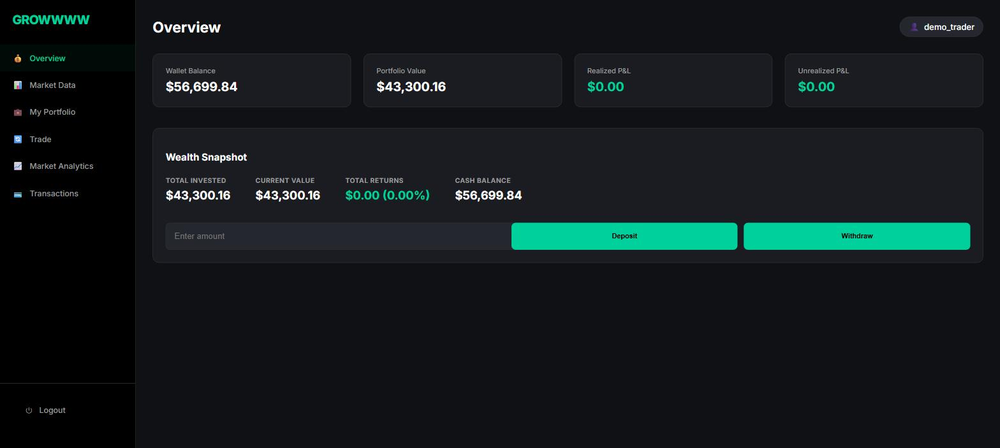
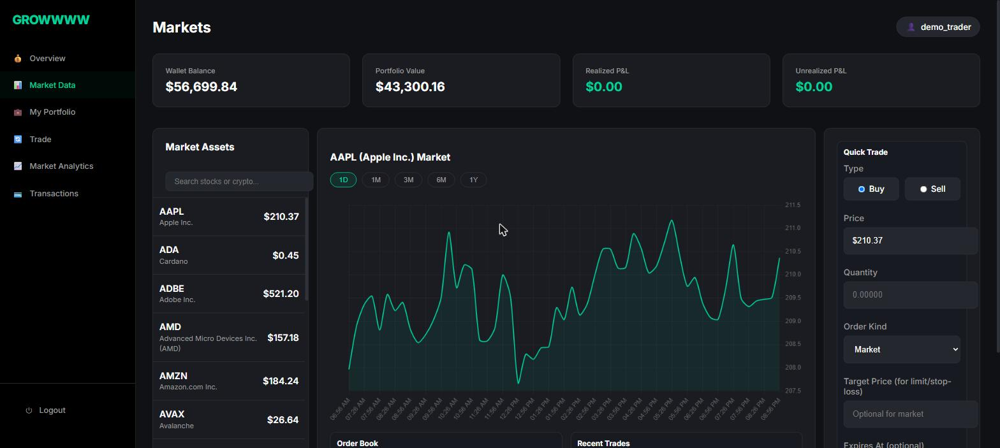
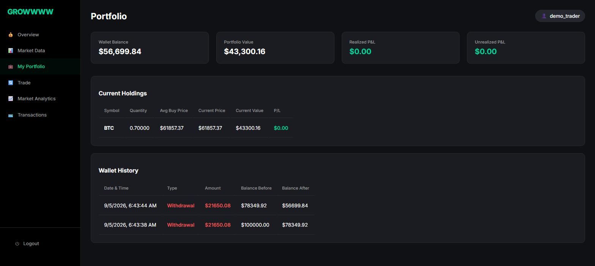

# Temporal Financial Market Analytics Platform

[](https://github.com/raghuram1233/Temporal-Financial-Market-Analytics-Platform/actions/workflows/ci.yml)
[](https://www.python.org/)
[](https://www.timescale.com/)
[](https://docs.astral.sh/ruff/)
[](https://mypy-lang.org/)
[](LICENSE)

> **Live demo:** not yet deployed. [`docs/DEPLOY.md`](docs/DEPLOY.md) is a step-by-step path to one (Fly.io + Timescale Cloud); the link belongs here once it is up.

A trading simulation and analytics platform built on **PostgreSQL + TimescaleDB**,
with business logic implemented as stored procedures and triggers rather than in
the application layer.

The interesting part is the database: a **bi-temporal portfolio model** that can
reconstruct any user's holdings at any point in time, hypertable partitioning
over tick data, continuous aggregates for OHLC charts, and native compression on
historical chunks.

```
124 tests passing · CI on Python 3.11/3.12 · ruff + mypy enforced · PostgreSQL 16 / TimescaleDB 2.15
```



<table>
<tr>
<td width="50%"></td>
<td width="50%"></td>
</tr>
<tr>
<td width="50%"><em>Live prices, OHLC chart, order book, and quick trade.</em></td>
<td width="50%"><em>Holdings with weighted-average cost basis, and the wallet audit trail.</em></td>
</tr>
</table>

---

## Quick start

Requires Docker. Nothing else.

```bash
cp .env.example .env

# Set the two required secrets
python -c "import secrets; print('DB_PASS=' + secrets.token_urlsafe(24))" >> .env
python -c "import secrets; print('FLASK_SECRET_KEY=' + secrets.token_hex(32))" >> .env

docker compose up -d --build      # database (schema auto-applied), API, worker
docker compose exec web python -m scripts.migrate      # apply pending migrations
docker compose exec web python -m scripts.seed_demo    # 90 days of demo prices
```

Open <http://localhost:5000>, register an account, and you start with $100,000
of simulated cash.

To stream live prices from Binance and Yahoo Finance instead of seeded data:

```bash
docker compose --profile ingest up -d
```

### Running without Docker

```bash
python -m venv .venv && .venv/Scripts/activate     # Windows
pip install -r requirements-dev.txt

psql -U postgres -c "CREATE DATABASE temporal;"
psql -U postgres -d temporal -f schema.sql

python -m scripts.migrate
python -m scripts.seed_demo
python -m backend.app          # http://localhost:5000
python -m backend.worker       # separate terminal: background jobs
```

---

## Architecture

```
backend/
  config.py      Validated environment configuration; refuses weak secrets
  database.py    Lazy connection pool, transaction() context manager
  money.py       Exact Decimal handling; money never becomes a float
  app.py         Flask app factory, two blueprints (pages + JSON API)
  worker.py      APScheduler jobs, run as a separate process
scripts/
  migrate.py     Applies pending SQL migrations, tracked in schema_migrations
  seed_demo.py   Generates synthetic market history
  ingest_data.py Live prices from Binance / Yahoo Finance
migrations/      Numbered, incremental schema changes
tests/           124 tests: security, cost basis, order matching, API flow
benchmarks/      Performance suite; results in benchmarks/RESULTS.md
schema.sql       Baseline: tables, hypertables, triggers, procedures, views
```

Three processes, deliberately separated:

| Service  | Role                                        |
|----------|---------------------------------------------|
| `web`    | gunicorn, 2 workers, serves UI and JSON API |
| `worker` | APScheduler: limit matching, order expiry   |
| `ingest` | Optional live market-data feed              |

The scheduler runs **only** in `worker`. Each gunicorn worker is a separate
process, so leaving the jobs in `web` would run every job once per worker.

---

## Performance

Measured on 5,000,000 rows across 25 assets spanning 730 days
(PostgreSQL 16.3 / TimescaleDB 2.15.2). Full methodology and query plans in
[`benchmarks/RESULTS.md`](benchmarks/RESULTS.md).

| Measurement | Result |
|---|---|
| Ingest throughput | **46,499 rows/sec** via `COPY` into the hypertable |
| Storage compression | **13.2x** — 708.8 MB down to 53.5 MB (92.5% saved) |
| Latest-price lookup | **1,443x** faster via the cache table than `DISTINCT ON` |
| OHLC, 30-day window | **16.9x** faster from the continuous aggregate |
| OHLC, 365-day window | **32.5x** faster from the continuous aggregate |

Reproduce with:

```bash
docker compose up -d db
python -m benchmarks.run_benchmarks --rows 5000000
```

Compression is not a pure win, and the report says so: storage drops 13x while
wide aggregate scans get roughly 1.3–1.9x *slower*, because each batch must be
decompressed before it can be aggregated. That is the reason the charts read
from `market_data_daily` rather than from raw ticks.

---

## Database design

### TimescaleDB features

| Feature | Applied to | Purpose |
|---|---|---|
| Hypertables | `market_data`, `orders`, `trades`, `realized_pnl` | Automatic time-based partitioning |
| Continuous aggregate | `market_data_daily` | Pre-computed daily OHLC for charts |
| Compression policy | `market_data` after 7 days | Shrinks historical tick data |
| `time_bucket` | Indicators, order book | Windowed aggregation |

### Bi-temporal portfolio

`portfolio` never updates a holding in place. Each trade closes the current row
(`valid_to`, `transaction_to` set to `NOW()`) and inserts a new version. A
partial unique index enforces that exactly one row per `(user_id, asset_id)` is
ever current:

```sql
CREATE UNIQUE INDEX idx_portfolio_unique_current ON portfolio(user_id, asset_id)
  WHERE valid_to IS NULL AND transaction_to IS NULL;
```

This keeps full history — you can ask what a portfolio looked like on any past
date — at the cost of writing three rows where a mutable table would write one.

### Money is never a float

The schema stores money as `NUMERIC`, and psycopg2 returns those columns as
`Decimal`. Every value used to be passed through `float()` on its way into a
JSON response, which handed the precision back at the one boundary the
`NUMERIC` columns existed to protect. `backend/money.py` enforces two rules:

**Nothing monetary becomes a float inside the process.** Input is parsed from
its textual form (`Decimal("0.1")` is exact; `Decimal(0.1)` inherits the
float's error), and arithmetic on balances stays in `Decimal`.

**Money crosses the wire as a JSON string.** `JSON.parse` turns any JSON
number into a float64 no matter how many digits the server wrote, so a numeric
field silently discards the precision at the client. Quoting it keeps the
digits intact and makes the client's rounding an explicit decision — the same
choice Stripe and Coinbase make. The frontend parses at the point of display
via `num()` / `fixed()` / `usd()` in `static/js/util.js`; nothing in the UI
does arithmetic on money.

```
GET /api/prices  →  {"symbol": "BTC", "price": "61857.37000000", ...}
```

`tests/test_security.py` covers the parser (including `Decimal("NaN")` and
`Decimal("Infinity")`, which `float()`-based validation would have caught but
a naive `Decimal()` port would not), and `test_api_flow.py` asserts that three
deposits of 0.10, 0.20 and 0.30 total exactly 0.60 — which they do not in
float64.

### Triggers

| Trigger | Fires on | Effect |
|---|---|---|
| `trg_create_wallet` | user insert | Creates the wallet |
| `trg_update_wallet_after_trade` | trade insert | Debits or credits cash |
| `trg_update_portfolio_after_trade` | trade insert | Versions the holding, books realized P&L |
| `trg_audit_wallet_changes` | wallet update | Logs before/after balances |
| `trg_update_latest_price_cache` | market_data insert | Maintains the latest-price cache |

Putting this in triggers means a trade and its effects commit atomically: there
is no application path that can insert a trade without updating the portfolio.
The tradeoff is that the logic is harder to debug and only testable against a
real Postgres — which is why `tests/test_portfolio.py` exists.

### Stored procedures

| Function | Purpose |
|---|---|
| `place_order()` | Validates and creates market / limit / stop-loss orders |
| `execute_trade()` | Checks funds or holdings under `FOR UPDATE`, then fills |
| `process_limit_orders()` | Matches open orders against the current price |
| `expire_stale_orders()` | Cancels orders past `expires_at` |
| `deposit_money()` / `withdraw_money()` | Wallet movements with balance checks |

`execute_trade` takes `SELECT ... FOR UPDATE` on the wallet row before checking
the balance, so two concurrent buys cannot both pass a check that only one can
afford. `tests/test_trading.py::TestConcurrency` proves this with two threads
racing on a barrier.

---

## Migrations

`schema.sql` builds a fresh database. Every change after that point is a
numbered file in `migrations/`, applied by a runner that records what it has
seen in a `schema_migrations` table.

```bash
python -m scripts.migrate --status    # what is applied, what is pending
python -m scripts.migrate --dry-run   # preview
python -m scripts.migrate             # apply
```

Each migration runs in its own transaction, so a failure rolls that file back
and stops with the ledger still accurate. Re-running is a no-op. The runner
also stores a checksum per migration and flags `CHANGED` if a file was edited
after being applied, which is the usual way a database silently diverges from
the repository.

Migrations are applied to the test database too, so tests exercise the same
shape as production rather than the bare baseline.

**`0002_orders_expiry_index`** is a worked example. `expire_stale_orders()`
sweeps every 5 minutes on `status = 'open' AND expires_at <= NOW()`. The
planner was reaching for `idx_orders_open_asset_kind_target`
(`asset_id, order_kind, status, target_price`); with only a `status` predicate
the leading columns are skipped, making it a full index scan with `expires_at`
filtered afterwards in the heap. A partial index on `expires_at` covering only
open, expiring orders turns that into an index-only scan — measured at
**3.6x faster** on 400,000 orders (6.22 ms to 1.75 ms).

---

## Testing

Every push runs the full suite in GitHub Actions against a real TimescaleDB
service container, on Python 3.11 and 3.12, plus a lint/type job (`ruff check`,
`ruff format --check`, `mypy`), a security job (secret scan, `pip-audit`,
`bandit`) and a job that builds the Docker stack and smoke-tests the running
API.

```bash
docker compose up -d db     # TimescaleDB on localhost:5433
pytest                      # 124 tests
pytest -m "not db"          # security tests only, no database needed
pytest --cov=backend --cov-report=term-missing

ruff check . && ruff format --check . && mypy    # what CI enforces
```

Lint rules and type settings live in `pyproject.toml`, so a local run and a CI
run cannot disagree about what counts as a failure.

Database tests create and drop a dedicated `temporal_test` database from
`schema.sql`, so they never touch development data.

| File | Covers |
|---|---|
| `test_security.py` | Auth, CSRF, CORS, rate limiting, exact-decimal parsing |
| `test_portfolio.py` | Weighted average cost basis, realized P&L, bi-temporal versioning |
| `test_trading.py` | Order validation, limit/stop-loss matching, expiry, concurrency |
| `test_api_flow.py` | Register → login → fund → trade → inspect → log out |

---

## Security

- **Rate limiting** on `/api/login` (10/min, 60/hour) and `/api/register`
  (5/hour), keyed on client IP. Without it, bcrypt verification is an
  unmetered CPU cost any single client can impose, and password guessing is
  free. Keyed on IP rather than username deliberately: a username key lets an
  attacker lock a victim out by guessing against their account on purpose
- **bcrypt** password hashing, with a 72-byte guard because bcrypt truncates
  silently beyond that
- **CSRF protection** on every state-changing request (Flask-WTF). `fetch` is
  wrapped once in `static/js/csrf.js` so the header is attached automatically
- **Session cookies** are `HttpOnly`, `SameSite=Lax`, and `Secure` outside debug
- **No secrets in source.** `config.py` raises at import time if `DB_PASS` or
  `FLASK_SECRET_KEY` is missing, short, or a known placeholder
- **CORS is same-origin by default** — a wildcard alongside session cookies
  would defeat CSRF entirely
- **Parameterised queries throughout.** Intervals are bound as
  `NOW() - (%s * INTERVAL '1 day')`, since a placeholder inside a quoted
  `INTERVAL '...'` literal cannot be bound
- **Generic error messages.** Database exceptions are logged server-side; only
  deliberate business-rule messages ("Insufficient balance") reach the client
- **Output escaping** on user-controlled values rendered into `innerHTML`
- **Proxy headers are not trusted by default.** `X-Forwarded-For` is only read
  when `TRUST_PROXY_HEADERS` is set, which should happen only behind a proxy
  that overwrites it. Trusting it with nothing in front would let a client
  send a different address per request and get a fresh rate-limit bucket each
  time — worse than no limiter, because it looks like there is one

Two honest limits on the rate limiting:

- Counters default to in-process (`memory://`), so with `--workers 2` a client
  gets twice the configured allowance before being refused. Set
  `RATELIMIT_STORAGE_URI` to Redis for a shared counter.
- CSRF validation runs before the view, so requests without a valid token are
  rejected at 400 without consuming limiter budget. That is the right order
  for real attacks — an attacker who fetches a token *is* counted, verified in
  `tests/test_security.py::TestRateLimiting` — but it does mean a token-less
  flood is bounded by the CSRF check rather than by the limiter.

---

## Configuration

All settings come from the environment; see `.env.example` for the full list.

| Variable | Required | Default | Notes |
|---|---|---|---|
| `DB_PASS` | yes | — | No fallback exists in code |
| `FLASK_SECRET_KEY` | yes | — | Min 32 chars; placeholders rejected |
| `DB_HOST` / `DB_PORT` | no | `localhost` / `5432` | Compose publishes `5433` |
| `SESSION_COOKIE_SECURE` | no | `not FLASK_DEBUG` | Set `false` for plain HTTP |
| `CORS_ORIGINS` | no | empty | Comma-separated; empty = same-origin |
| `ENABLE_SCHEDULER` | no | `true` | `false` in `web`, `true` in `worker` |
| `MAX_DEPOSIT` | no | `500000` | Per-deposit cap |
| `RATELIMIT_ENABLED` | no | `true` | Off only for local load testing |
| `RATELIMIT_STORAGE_URI` | no | `memory://` | Use Redis to share across workers |
| `RATELIMIT_LOGIN` | no | `10 per minute;60 per hour` | Per client IP |
| `RATELIMIT_REGISTER` | no | `5 per hour` | Per client IP |
| `TRUST_PROXY_HEADERS` | no | `false` | Enable only behind a real proxy |

---

## Features

**Trading** — market, limit, and stop-loss orders, with optional expiry.
**Portfolio** — live holdings, auto-calculated cost basis, realized and
unrealized P&L. **Wallet** — deposits, withdrawals, full audit trail.
**Market data** — 25 assets (12 crypto, 13 equities), OHLC candlesticks across
1D–1Y, order-book depth, recent trades. **Analytics** — 7-day SMA, rolling
volatility, leaderboard, most-traded assets.

## Stack

| Layer | Technology |
|---|---|
| Database | PostgreSQL 16, TimescaleDB 2.15 |
| Backend | Flask 3, psycopg2, bcrypt, Flask-WTF, Flask-Limiter |
| Frontend | Jinja2, vanilla JS, Chart.js |
| Jobs | APScheduler |
| Serving | gunicorn |
| Data | Binance API, Yahoo Finance (yfinance) |
| Tests | pytest, pytest-cov |
| Quality | ruff (lint + format), mypy |
